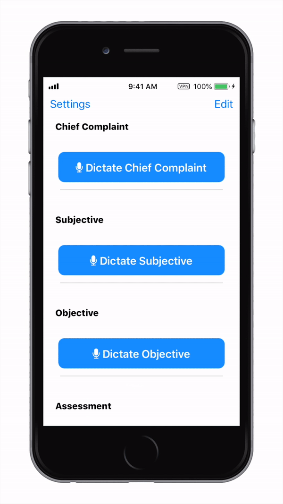

# Mobile frontend app written in React-Native

Helps healthcare providers dictate their notes with Apple's Speech Recognition API. Available at Soapdictate.com.

[App Store Link](https://itunes.apple.com/app/id1384252497) 

running locally:
	
	npm install react-native-cli -g
	npm install

iOS:
	
	react-native run-ios --simulator="iPhone SE"
	react-native run-ios --simulator="iPhone XR"
	
	react-native run-ios --simulator="iPhone X"
	react-native run-ios --simulator="iPhone 6 Plus"
	react-native run-ios --simulator="iPad Pro (12.9-inch)"

Android:
Download Java SE Development Kit 8, Android Studio. Plug in Android device with debugger on or open emulator. Then:

	adb devices
	react-native run-android

editor's note: To hack to newest version of react-native, simply create a new react native app, replace the package.json of this repository with the new one, then do

	npm install --save react-native-animatable react-native-button react-native-fontawesome react-native-html-to-pdf react-native-iap react-native-mixpanel react-native-sound react-native-voice react-navigation

--------------------------------

# Minimal email server 0.1

soapdictate uses this server to store the emails – a barebones Node.js app using [Express 4](http://expressjs.com/).

### Running Locally

Make sure you have [Node.js](http://nodejs.org/) and the [Heroku CLI](https://cli.heroku.com/) installed.

	$ npm install
	$ npm start

Your app should now be running on [localhost:5000](http://localhost:5000/), however you'll need PostgreSQL set up locally to run it 

### Deploying to Heroku

	
	git add emailserver/
	git commit -m "improved email server"
	git push heroku `git subtree split --prefix emailserver master`:master --force

--------------------------------

# Mimimal web presence at soapdictate.com written in Hugo

to deploy to github pages, simply run "hugo" command to build to "docs" folder and deploy.

	cd static\ website\ generator/
	hugo

This generates a "docs" folder with static website in it – move this to root of repo for publishing to Github pages or another service.
	
	mv docs ..
	cd ..
	git add docs/
	git commit -m "new content update"
	git push origin master

